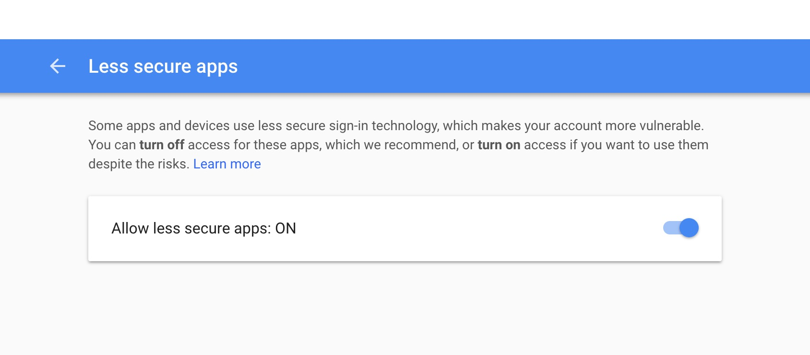

## React Nodemailer Demo

# Setup

Install Nodemailer

```
npm i nodemailer
```

In your server file:

```
const nodemailer = require('nodemailer');
```

Set up your transporter variable as follows. You will need to you the email and password for whatever email you want your emails sent from as the USER_EMAIL and USER_PASS. 

```
    let transporter = nodemailer.createTransport({
        service: 'gmail',
        secure: true,
        auth: {
            user: process.env.USER_EMAIL, //sender email address
            pass: process.env.USER_PASS //sender email password
        }
    });

```

Create a mailOptions object which with have a from property that tells where the email is coming from, where the email is going to, the subject line, and the text body of the message you want sent. 


```
    let mailOptions = {
        from: `"Mailing List Request" <${process.env.USER_EMAIL}>`, // sender email address
        to: emailAddress, //email address you want to send email to.
        subject: 'Welcome!', // Subject line
        text: `Thanks for joining our mailing list ${firstName} ${lastName}!`  //body of email.       
    };
```

Now invoke sendMail from transports passing in the mailOptions as the first parameter and a callback as the second. This callback will let you know if the email sent was successful or not. 

```
    transporter.sendMail(mailOptions, (error, info) => {
        if (error) {
            console.log(error)
            res.send(error)
        }
        res.status(200).send(info);
    });
})
```

Be sure to turn on the Allow less secure apps option in your gmail account that you are using to send the emails from. 



# Helpful Links

[Docs](https://nodemailer.com/about/)